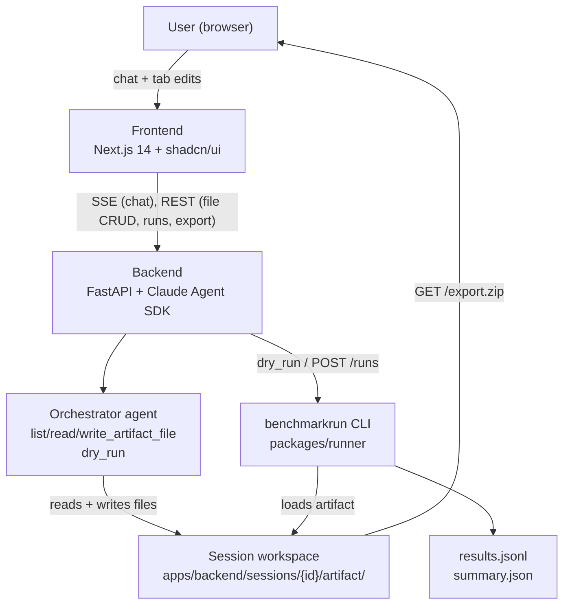

# benchmarkagent_florentxlundaisociety

## Problem statement

Large language models (LLMs) have become remarkably capable, yet deploying them reliably on real-world, domain-specific tasks remains difficult — not because the models lack power, but because the gap between a general-purpose LLM and a trustworthy fit-for-purpose system is hard to measure.

Downstream tasks are highly specialized. A legal team processing contracts, a biotech company parsing research notes, or a software team working with a proprietary configuration format each face evaluation challenges that no off-the-shelf benchmark captures. The relevant failure modes, edge cases, and quality criteria are domain-specific and often tacit — known to the domain expert but never written down in a form an LLM evaluation framework can consume.

At the same time, the users closest to these tasks — domain experts, product managers, and business stakeholders — typically lack the ML and software engineering background needed to:

- Define quantitative evaluation criteria for subjective or domain-specific quality
- Curate representative test cases that reflect real-world distribution
- Select or implement appropriate metrics (beyond naive accuracy)
- Interpret evaluation results and translate them into actionable model or prompt improvements

Existing evaluation tooling (e.g., HELM, OpenAI Evals, lm-evaluation-harness) is designed for ML engineers and assumes significant technical depth, leaving the majority of LLM users without a practical path to principled evaluation.

**BenchmarkAgent** addresses this gap. It is an agent-assisted system that guides non-technical users through the process of constructing a meaningful, task-specific benchmark for their LLM deployment. By interviewing the user about their use case, surfacing relevant failure modes, helping generate and validate test cases, and explaining evaluation tradeoffs in plain language, BenchmarkAgent makes rigorous LLM evaluation accessible without requiring ML expertise.

---

## Solution

BenchmarkAgent pairs a conversational construction agent with a runtime-agnostic artifact so the rigor produced in the chat outlives the chat itself.

The system has three deliberately decoupled phases:


| Phase               | What happens                                                                                                                                                                 | Boundary                                                  |
| ------------------- | ---------------------------------------------------------------------------------------------------------------------------------------------------------------------------- | --------------------------------------------------------- |
| **1. Construction** | A domain expert chats with the orchestrator agent in a web UI. The agent interviews, drafts, and iterates until all four artifact files are correct.                         | Filesystem — the agent writes files; the user edits them. |
| **2. Artifact**     | A self-contained directory (`manifest.yaml`, `dataset.jsonl`, `adapter.py`, `evaluator.py`) that fully describes the benchmark. Human-readable and human-editable by design. | Artifact schema — the runner knows only this contract.    |
| **3. Execution**    | `benchmarkrun <artifact_dir> --model <model>` loads the artifact and runs it against any supported model. No backend, no agent infrastructure required.                      | —                                                         |


The artifact independence promise is non-negotiable: `pip install benchmarkrun` plus the artifact directory is sufficient to reproduce any run on any machine. See `[examples/classification_demo/](examples/classification_demo/)` for the canonical reference artifact.

---

## Technical approach

### Architecture




### Components

`**packages/artifact_schema**` — Pydantic models for all four artifact files. The single source of truth for what a valid artifact looks like. Enforces the LLM-judge invariant: if `judge.type: "llm"`, then `model`, `temperature: 0`, and `prompt_template` are all required. Imported by both the runner and the backend; depends on nothing in this repo.

`**packages/runner**` (`benchmarkrun`) — Standalone pip-installable CLI. Validates the manifest via `artifact_schema`, dynamically imports `adapter.py` and `evaluator.py`, constructs a `ModelClient` for Anthropic or OpenAI, iterates `dataset.jsonl`, and writes `results.jsonl` + `summary.json`. Never imports backend code.

`**apps/backend**` — FastAPI service. Owns session workspaces under `apps/backend/sessions/`. Exposes: `POST /sessions`, `GET|PUT /sessions/{id}/artifact/*`, `POST /sessions/{id}/messages` (SSE), `POST /sessions/{id}/runs`, `GET /sessions/{id}/export.zip`. Runs the Claude Agent SDK orchestrator which has four tools: `list_artifact_files`, `read_artifact_file`, `write_artifact_file`, and `dry_run`.

`**apps/frontend**` — Next.js 14 two-pane layout: chat (left) and tabbed artifact editors (right). Tabs: Intent · Schema · Dataset · Adapter · Evaluator · Results. Dumb by design — all logic lives in the backend or the artifact files.

### Dataset access modes

The orchestrator operates in one of two modes set by the user in the UI. In **visible mode** the agent can read, write, and validate `dataset.jsonl` and trigger dry runs. In **hidden mode** all dataset file I/O and `dry_run` are blocked — the agent guides the user based on the schema alone, and verification happens when the user runs the artifact themselves. This is a privacy boundary: in hidden mode the main orchestrator never receives raw user data.

---

## How to run the project

### Prerequisites

- Python ≥ 3.11
- Node.js ≥ 18
- `[uv](https://docs.astral.sh/uv/)` for Python dependency management
- At least one of `ANTHROPIC_API_KEY` or `OPENAI_API_KEY`

### Configure environment

```bash
cp .env.example .env
# Fill in ANTHROPIC_API_KEY and/or OPENAI_API_KEY
```

For the frontend, create `apps/frontend/.env.local`:

```
NEXT_PUBLIC_BACKEND_URL=http://127.0.0.1:8000
```

See `[.env.example](.env.example)` for all optional settings (`BMK_ORCHESTRATOR_MODEL`, `ANTHROPIC_BASE_URL`, etc.).

### Standalone runner (no backend needed)

This verifies the artifact-independence promise:

```bash
uv pip install -e packages/artifact_schema -e packages/runner
benchmarkrun examples/classification_demo --model claude-haiku-4-5-20251001 --limit 3
```

Produces `results.jsonl` and `summary.json` in the current directory. No backend or frontend involved.

### Full agent stack

**Terminal 1 — backend** (install from `apps/backend`, run from repo root so `python-dotenv` finds `.env`):

```bash
cd apps/backend && uv pip install -r pyproject.toml -p ../../.venv && cd ..
.venv/bin/uvicorn backend.main:app --reload --app-dir apps/backend/src
```

**Terminal 2 — frontend:**

```bash
cd apps/frontend
npm install
npm run dev
```

Open `http://localhost:3000`, chat with the orchestrator to build a benchmark, edit files in the artifact tabs, trigger a dry run, and export the artifact as a zip. The exported zip can then be run with `benchmarkrun` using the standalone instructions above.